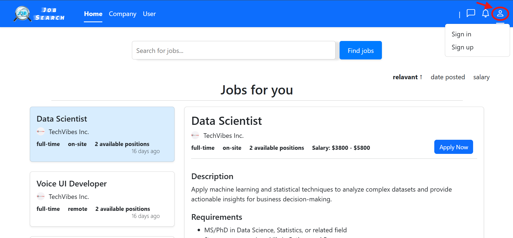
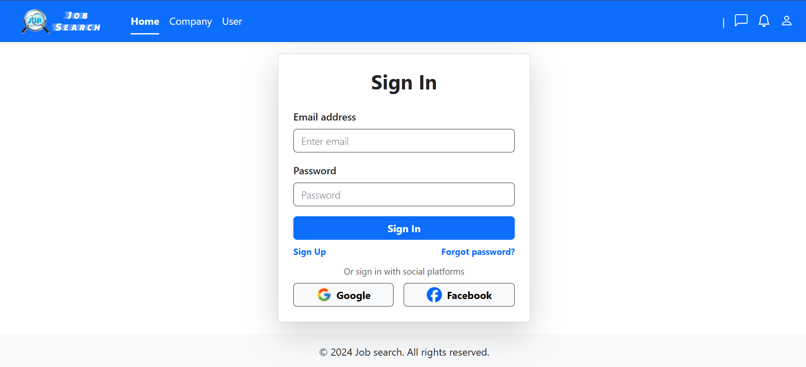
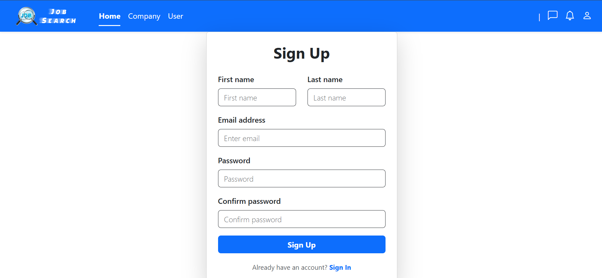
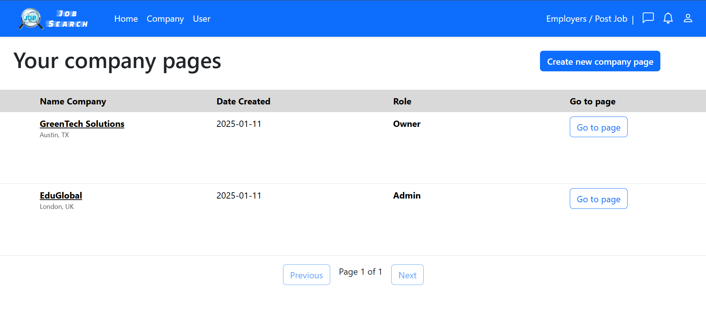
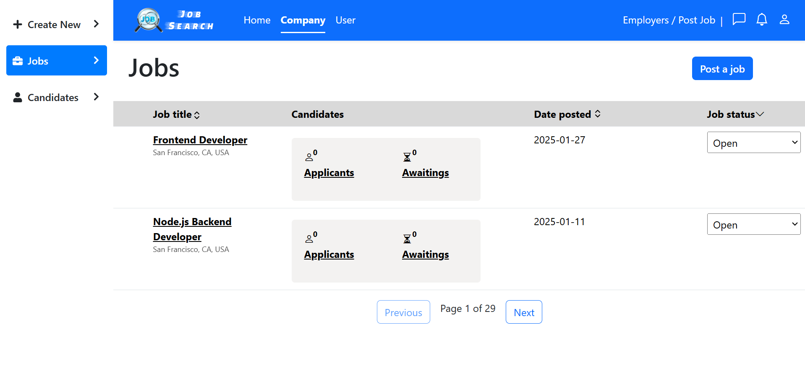
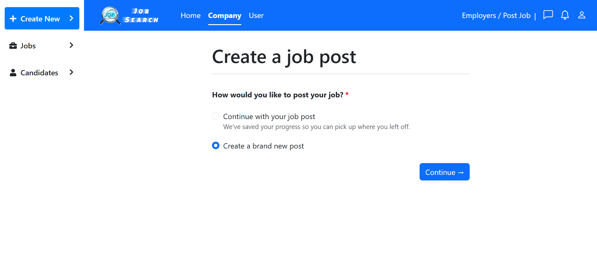
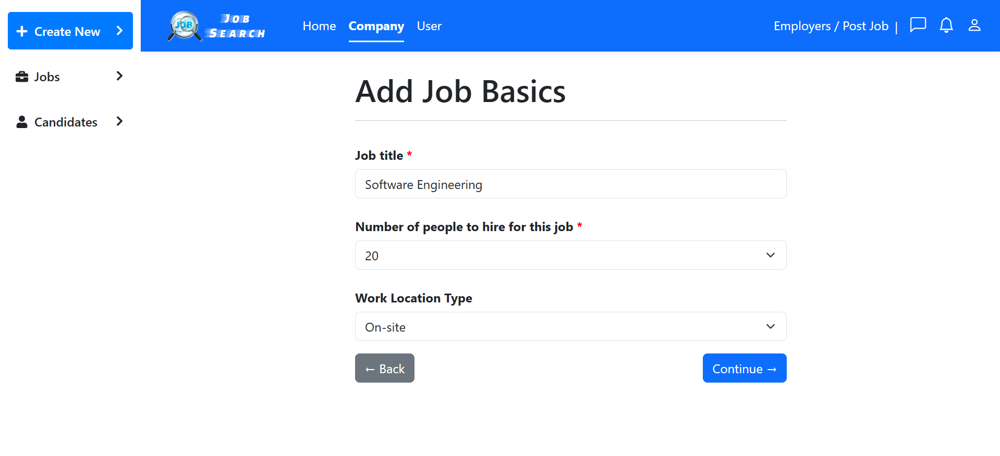
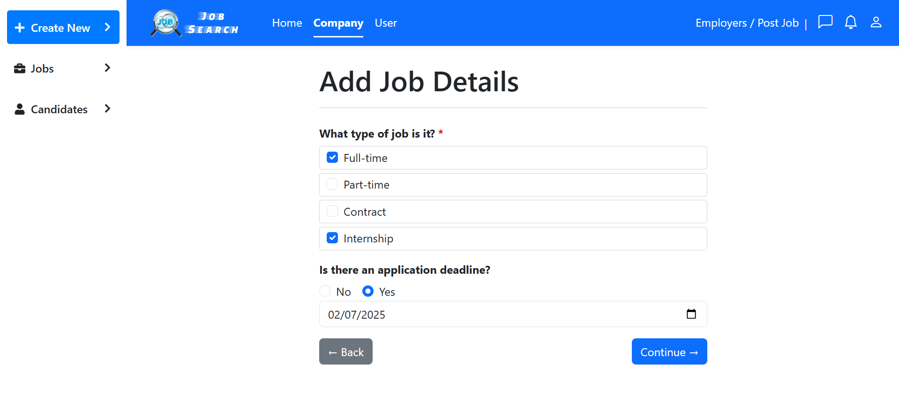
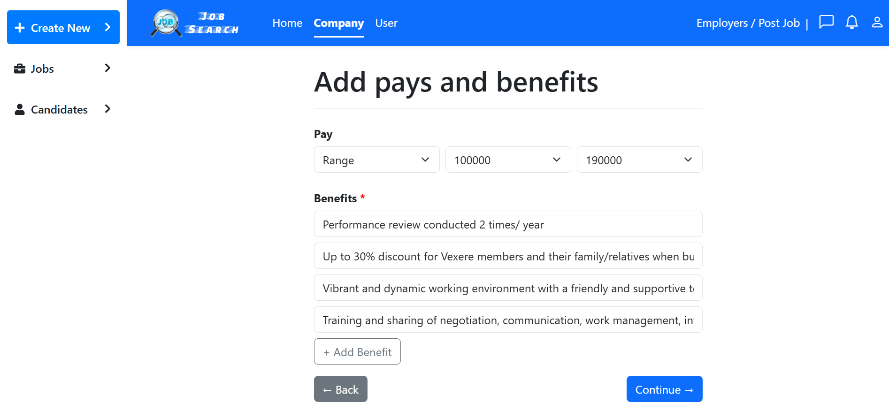
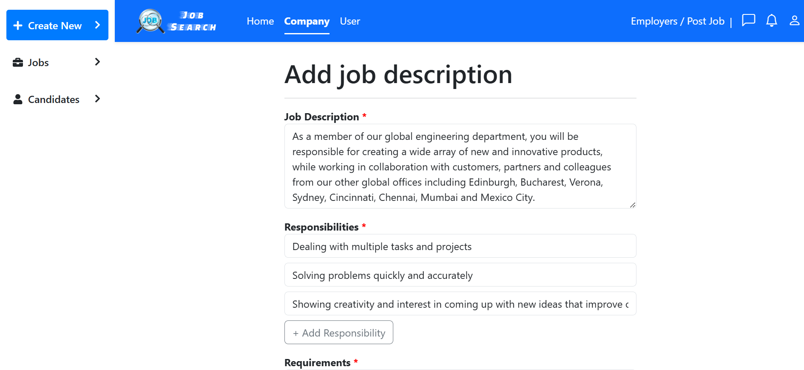

<!--Project logo and contributors-->
<div align="center" style="font-family: Arial, sans-serif;">
  <!-- Logo -->
  <a href="#">
    
  </a>
  
  <!-- Title -->
  <h1 style="font-size: 2.5rem; font-weight: bold; color: #333; margin: 0;">JOB SEARCH</h1>
  
  <!-- Subtitle -->
  <p style="font-size: 1.25rem; color: #555; margin: 5px 0;">FIT - HCMUS</p>
  <p style="font-size: 1rem; color: #777; text-transform: uppercase; margin: 0;">Introduction to Software Engineering</p>
  
</div>

<!-- Contributors -->
<div style="margin-top: 20px; font-family: Arial, sans-serif;">
  <h2 style="font-size: 1.4rem; color: #333; font-weight: bold; margin-bottom: 10px;">Contributors</h2>
  <ul style="list-style: none; padding: 0; margin: 0;">
    <li style="margin: 8px 0;">
      <a href="https://github.com/ngocdai101004" target="_blank" style="text-decoration: none; color: #007bff; font-size: 1rem; font-weight: 500;">
        Tran Ngoc Dai
      </a>
    </li>
    <li style="margin: 8px 0;">
      <a href="https://github.com/fusodoya" target="_blank" style="text-decoration: none; color: #007bff; font-size: 1rem; font-weight: 500;">
        Song Dong Gia Phuc
      </a>
    </li>
    <li style="margin: 8px 0;">
      <a href="https://github.com/tuongkhtn" target="_blank" style="text-decoration: none; color: #007bff; font-size: 1rem; font-weight: 500;">
        Huynh Thanh Tuong
      </a>
    </li>
    <li style="margin: 8px 0;">
      <a href="https://github.com/tuann04" target="_blank" style="text-decoration: none; color: #007bff; font-size: 1rem; font-weight: 500;">
        Vo Anh Tuan
      </a>
    </li>
  </ul>
</div>

## 1. JobSearch - Empowering Connections Between Job Seekers and Employers

**JobSearch** is an online platform designed to connect job seekers with employers, optimizing the process of job searching and recruitment.

#### For Job Seekers (Applicants):

Users can easily create professional profiles, including personal information, work experience, skills, and certifications. With an intelligent search and filter system, applicants can find and apply for suitable jobs while receiving notifications about new positions from their favorite employers.

#### For Employers:

Businesses can post detailed job listings, manage the application review process, and build credibility through feedback from applicants. The enterprise verification feature ensures trust and transparency on the platform.

#### Objective

The objective of **JobSearch** is to provide a user-friendly interface, an optimized search system, and an efficient recruitment management process, delivering a simple yet professional experience for both job seekers and employers.

## 2. How to run

1. Make sure that you have installed Node.js (v22.12.0) and MongoDB
2. Clone the repository
3. Run `npm install` in both backend and frontend directories
4. Create a `.env` file in the **backend** directory and add the following variables:

```dotenv
PORT=3200
MONGO_URI=<your mongo uri>
JWT_SECRET=secret
JWT_EXPIRE=30d
EMAIL_USER=<your email>
EMAIL_PASS=<your email pass>
GENERATIVE_AI_API_KEY = <your Gemini API key>


```

5. Create a `.env` file in the **frontend** directory and add the following variables:

```dotenv
VITE_S3_SECRET=<your secret key | that appear once when you create>
VITE_S3_KEY=<your key>
VITE_S3_ENDPOINT=<your endpoint>
VITE_S3_BUCKET=jobsearch
```

6. Run `npm run dev` in the backend and frontend directories

## 3. Add mock data

1. Go to 'backend/src/data' directory
2. Modify the '\*.ts' files. Those are mock data files
3. Run `npm run build` to transpile the TypeScript files to JavaScript
4. Run `npm run data:import` to import the mock data to the database
5. Mock data should be added to the database. You can check it by using MongoDB Compass or MongoDB shell

You should add mock data whenever you introduced a new feature or fixed a bug to make sure that the application works
correctly.

## 4. Screen

### Sign in

<a href="#">
  
</a>
<a href="#">
  
</a>

- A login page allowing users to sign in with email, password, or via Google and Facebook.

### Sign up

<a href="#">
  
</a>

- A signup page where users can create an account by providing their first name, last name, email, password, and confirming the password.

### Company Management

<a href="#">
  
</a>

- This is the company management page where users can view and manage their companies, including roles and creation dates, and navigate to specific company pages.

### Company Dashboard

<a href="#">
  
</a>

- This is a simple job dashboard displaying a list of job positions with information about job titles, locations, number of applicants, status, and posting dates.

### Post Job

<a href="#">
  
</a>
<a href="#">
  
</a>
<a href="#">
  
</a>
<a href="#">
  
</a>
<a href="#">
  
</a>
<a href="#">
  
</a>

- Companies can post job openings to attract potential candidates for available positions.
